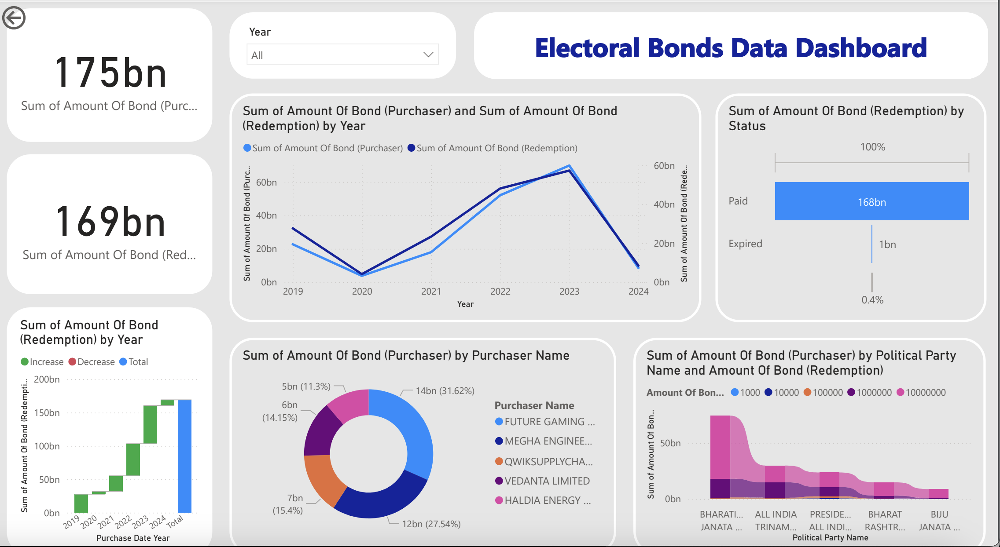

# Electoral Bonds Data Analysis With Dashboard

This repository contains the code and resources for the Electoral Bonds Data Analysis Dashboard. This project involves analyzing electoral bond transactions and visualizing the data using Python and Power BI.

## Table of Contents

- [Introduction](#introduction)
- [Data](#data)
- [Setup](#setup)
- [Usage](#usage)
- [Visualization](#visualization)
- [License](#license)

## Introduction

The Electoral Bonds Data Analysis Dashboard provides insights into the transactions of electoral bonds. It includes:
- Total amount of bonds purchased and redeemed.
- Breakdown of bond purchasers.
- Redemption analysis by political party.

## Data

The project uses two primary datasets:
1. **Donors Data**: Information about bond purchasers.
2. **Receiver Data**: Information about bond redemptions by political parties.

## Setup

To set up the project locally, follow these steps:

1. Clone the repository:
   ```bash
   git clone https://github.com/vedantcoder44088/Electoral_Bond_Analysis_With_PowerBI.git
   cd Electoral_Bond_Analysis_With_PowerBI
   ```

2. Make sure you have Power BI installed to view the dashboard.

## Usage

1. Place the `donors_data.xlsx` and `redemption_data.xlsx` files in the project directory.
2. Run the data analysis script:
   ```bash
   python Electoral_Bond_Analysis.py
   ```
3. Open the Power BI dashboard file (`electoral_bonds_dashboard.pbix`) to view the visualizations.

## Visualization



The Power BI dashboard provides interactive visualizations for:
- Yearly bond purchases and redemptions.
- Breakdown of bond purchasers.
- Analysis of bond redemptions by political party.


## License

This project is licensed under the MIT License. See the [LICENSE](LICENSE) file for details.
```
